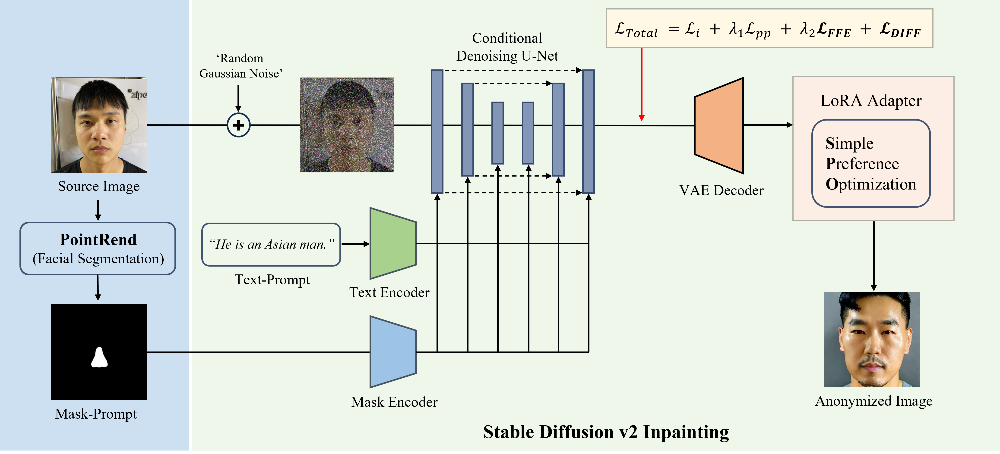

# Anonymize-Anyone
Anonymize Anyone: Toward Race Fairness in Text-to-Face Synthesis using Simple Preference Optimization in Diffusion Model

This repository contains the implementation of the following paper:


<be>
 
## :open_book: Overview
<!--  -->


**Anonymize Anyone** presents example results of anonymized Asian images. 

<!--  -->


We propose **Anonymize Anyone**, a text-to-face synthesis using a Diffusion Model that considers Race Fairness.
	We used the facial mask from the facial segmentation model to prompt edits in specific facial regions. The Stable Diffusion v2 Inpainting model used as our baseline, trained on the curated Asian dataset. We applied **ℒ𝐹𝐹𝐸**(Focused Feature Enhancement Loss) to enhance performance even with limited data and used **ℒ𝑫𝑰𝑭𝑭**(Difference Loss) to address the catastrophic forgetting issue of the pre-trained model. Finally, we employed a model trained with **Simple Preference Optimization** (SimPO) to generate more refined and enhanced images.

<be>

## 💡 Colab Demo
Try out our colab demo here [](https://colab.research.google.com/github/dusrb37/Anonymize-Anyone/blob/main/demo_anonymize_anyone.ipynb)

## 💡 Model Checkpoints
Check out our models on Hugging Face:

[](https://huggingface.co/fh2c1/Anonymize-Anyone)

[](https://huggingface.co/fh2c1/SimPO-LoRA)


## :heavy_check_mark: Updates
- [08/2024] [Colab Demo](https://github.com/dusrb37/Anonymize-Anyone) for Anonymize Anyone released.
- [08/2024] [Training code](https://github.com/dusrb37/Anonymize-Anyone) for Inpainting released.
- [08/2024] [Training code](https://github.com/dusrb37/Anonymize-Anyone) for SimPO-Diffusion released.
- [08/2024] [Inference code](https://github.com/dusrb37/Anonymize-Anyone) for Anonymize Anyone released.

## :hammer: Setup

### Environment

```bash
conda create -n anonymize python=3.10.13
conda activate anonymize

git clone https://github.com/fh2c1/Anonymize-Anyone.git
pip install peft
pip install diffusers
pip install -r requirements.txt
```

<be>

## ⬇️: Get the Segmentation Mask

### 1. Pretrained model
1. Download the pretrained model from [Google Drive](https://drive.google.com/file/d/1-0K1gMrjq0C7ssP4UDGePBr8CND4cAJC/view).
2. Download the annotations from  [Google Drive](https://drive.google.com/file/d/1zAEiTPFPky7ilQ1Ou-Kzi9sPVdvx2nnt/view)

3. Put the model under `pretrained` , `annotations` as follows:
    ```
    Anonymize-Anyone
    └── segmentation
        └── pointrend
            └── model_final.pth
        └── dataset
            └── _annotations.coco
    ```
   

### 2. Segmentation mask

1. Please set the environment by referring to the GitHub link. [Detectron2](https://github.com/facebookresearch/detectron2) , [PointRend](https://github.com/facebookresearch/detectron2/blob/main/projects/PointRend/README.md)

2. Prepare your own images for input:
Place your own images in the input folder. As we trained on patient photos, we do not provide input images.

```bash
python ./segmentation/test_face_segment.py
```
Find the output in `./segmentation/output`

<be>


## :running_man: Train

### 1. Train for the inpainting model


#### **Training with Focused Feature Enhancement Loss & Difference Loss**

**'Focused Feature Enhancement Loss'** is used to effectively learn detailed areas. **'Difference Loss'** enables the model to distinguish between the two classes (e.g. Asians and Caucasians) and preserve their respective. For difference loss, we first generate images using the model with a difference prompt and then use those during training along with our data. Refer to the paper to learn more about it.

___Note: It needs at least 24GB VRAM.___


```bash
export MODEL_NAME="stabilityai/stable-diffusion-2-inpainting"
export INSTANCE_DIR="path-to-instance-images"
export DIFFERENCE_DIR="path-to-difference-images"
export OUTPUT_DIR="path-to-save-model"

accelerate launch ./train_anonymize_inpaint.py \
  --pretrained_model_name_or_path=$MODEL_NAME  \
  --train_text_encoder \
  --instance_data_dir=$INSTANCE_DIR \
  --difference_data_dir=$DIFFERENCE_DIR \
  --output_dir=$OUTPUT_DIR \
  --ffel_weight=0.01 \
  --threshold=0.5 \
  --with_difference_loss \
  --instance_prompt="a photo of asian" \
  --difference_prompt="a photo of white man" \
  --resolution=512 \
  --train_batch_size=1 \
  --use_8bit_adam \
  --gradient_checkpointing \
  --learning_rate=1e-6 \
  --lr_scheduler="constant" \
  --lr_warmup_steps=0 \
  --num_difference_images=300 \
  --max_train_steps=10000 \
```

### **Important Args**

#### **General**

- `--pretrained_model_name_or_path` what model to train/initalize from
- `--INSTANCE_DIR` path for dataset that you want to train
- `--DIFFERENCE_DIR` path-for difference images
- `--output_dir` where to save/log to
- `--instance_prompt` prompt that you want to train
- `--train_text_encoder` fine-tuning `text_encoder` with `unet` can give much better results, especially for faces

#### **Loss**

- `--ffel_weight` Focused Feature Enhancement Loss
- `--threshold` Parameter for critical feature mask, It is recommended to experiment by adjusting it up or down from 0.5
- `--with_difference_loss` Difference Loss
- `--difference_prompt` Prompt that you want to preserve
- `--num_difference_images` Number of generating images for difference prompt, 200-300 worked well for our cases


### 2. Train for SimPO

Run the shell script below for training SimPO. 

```bash
# from ./tarin_diffusion_simpo.sh
export MODEL_NAME="stabilityai/stable-diffusion-2-1"
export DATASET_NAME="yuvalkirstain/pickapic_v2"

accelerate launch ./train_diffusion_simpo.py \
  --pretrained_model_name_or_path=$MODEL_NAME \
  --dataset_name=$DATASET_NAME \
  --mixed_precision="fp16" \
  --train_batch_size=8 \
  --dataloader_num_workers=16 \
  --gradient_accumulation_steps=2 \
  --max_train_steps=30000 \
  --checkpointing_steps=1000 \
  --lr_scheduler="constant" --lr_warmup_steps=0 \
  --learning_rate=1e-5 \
  --gradient_checkpointing \
  --use_8bit_adam \
  --rank=8 \
  --resolution=512 \
  --seed="0" \
  --run_validation --validation_steps=50 \
  --report_to="wandb" \
  --output_dir="SIMPO" \
  --push_to_hub
```

### Important Args

#### **General**

- `--pretrained_model_name_or_path` what model to train/initalize from
- `--output_dir` where to save/log to
- `--seed` training seed (not set by default)

#### **SimPO**

- `--beta` Beta parameter for SimPO
- `--gamma_beta_ratio` Gamma/beta ratio for SimPO
- `--loss_type` SimPO loss type (sigmoid, hinge, etc.)


#### **Optimizers/learning rates**

- `--max_train_steps` How many train steps to take
- `--gradient_accumulation_steps`
- `--train_batch_size` see above notes in script for actual BS
- `--checkpointing_steps` how often to save model
- `--gradient_checkpointing` turned on automatically for SDXL
- `--learning_rate`
- `--scale_lr` Found this to be very helpful but isn't default in code
- `--lr_scheduler` Type of LR warmup/decay. Default is linear warmup to constant
- `--lr_warmup_steps` number of scheduler warmup steps
- `--use_adafactor` Adafactor over Adam (lower memory, default for SDXL)

#### **Data**
- `--dataset_name` if you want to switch from Pick-a-Pic
- `--cache_dir` where dataset is cached locally **(users will want to change this to fit their file system)**
- `--resolution` defaults to 512
- `--random_crop` and `--no_hflip` changes data aug
- `--dataloader_num_workers` number of total dataloader workers

#### **LoRA rank**
- `--rank` LoRA rank

#### **Validation**
- `--run_validation` Whether to run validation
- `--validation_steps` How often to run validation

#### **Additional SimPO-specific args**
- `--vae_encode_batch_size` Batch size to use for VAE encoding of the images
- `--report_to` The integration to report the results and logs to
- `--mixed_precision` Whether to use mixed precision training
- `--enable_xformers_memory_efficient_attention` Whether to use xformers for memory efficient attention


<be>

## ✈️ Inference

To inference, Checkout - `inference.ipynb` for mode details.


For your dataset, change the path of the image and mask.

<be>
   
## ❤️ Acknowledgement

We thank the authors for their great work. 
- We were heavily inspired by [DreamBooth](https://arxiv.org/abs/2208.12242) for how train effectively with a small dataset and [SimPO](https://arxiv.org/abs/2405.14734) for how to optimize Simple Preference to model.
- Our inpainting training pipeline was modified from [the diffusers library](https://github.com/huggingface/diffusers).
